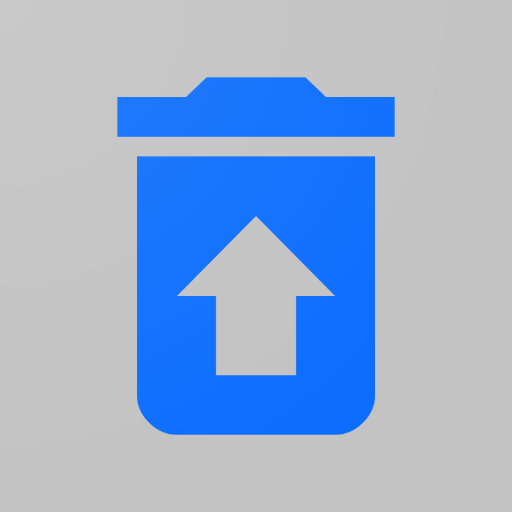

# BetterBin

Self-hosted pastebin, link shortner and file drop solution with an API.


<br/>

## Features

-   API based, everything can be interacted with using CLI or code.
-   Pastebin.
-   Markdown or syntax highlighting typre preview for pastes.
-   Add expiry to pastes or burn them after reading.
-   Password protect pastes.
-   Link Shortner.
-   File Drop.
-   Imgur like preview for image or video file drops.

## User/API Documentation

All paths are relative to your deployment, like `betterbin.example.com`. In the following routes, `-> json` means that the response is in json.

### Routes

**GET `/paste/new`** -> html :

-   Create a new paste through the web page.

**POST `/paste/new`** -> json :

-   Create a new paste through a url-encoded POST request.
-   Parameter `title` - Your paste title. (Optional.)
-   Parameter `content`- Your paste content. (Required.)
-   Parameter `expiry` - One of `year`, `month`, `week`, `day`, `hour`, `10min`, `1min`, `burn`, `never`. (Optional. Default is `never`.)
-   Parameter `password` - If you want your new paste to be password protected. (Optional.)

**GET/POST `/paste/view/{pasteID}`** -> html :

-   Parameter `password` - If that paste is password protected. You can also enter the password in the web page when prompted. (Optional.)
-   Parameter `preview` - Preview type. One of `markdown`, `code` and `plain`. (Optional.)

Example `betterbin.example.com/paste/view/{pasteID}?preview=code`

**GET/POST `/paste/raw/{pasteID}`** -> raw text :

-   Parameter `password` - If that paste is password protected. (Optional.)

**GET `/shortner/new`** -> html :

-   Create a new short link through the web page.

**POST `/shortner/new`** -> json :

-   Create a new short link through a url-encoded POST request.
-   Parameter `url` - The long URL you want to shorten. (Required.)

**GET `/s/{linkID}`** -> redirects to complete URL. :

-   Visiting this link redirects you to the complete URL.

**GET `/drop/new`** -> html :

-   Upload a new file/image/video through the web page.
-   File size limit is 10 MB.

**POST `/drop/new`** -> json :

-   Upload a new file using a multipart POST request.
-   Parameter `upload` - Attach your to be uploaded file here. (Required.)
-   Parameter `title` - The title for your file. (Optional.)
-   File size limit is 10 MB.

**GET `/drop/dl/{dropID}`** -> html :

-   Download your file drop through the web page. I the file is an image or a video then a preview will also be shown on this page.

**GET `/drops/{dropFileName}`** -> downloadable file :

-   Visiting this link returns your downloadable file.

### Examples

**Convert a text file to a sharable paste using curl**

`curl --data-urlencode content@somefile.txt https://betterbin.example.com/paste/new`

## Deployment Instructions

### Manually

-   Get the executable binary from github releases or build your own (read the Makefile).
-   `mkdir BetterBin`
-   Copy the executable binary, the `db`, `templates` and `static` folders into the directory.
-   touch `betterbin.sqlite`
-   Download and install [goose](https://github.com/pressly/goose) for migrations.
-   `goose -dir ./db/sql sqlite3 ./betterbin.sqlite up`
-   `./BetterBin -p 8963 -d ./betterbin.sqlite` will start it at port 8963.
-   Use a reverse proxy like caddy/nginx/httpd/traefik for SSL.

### Containerized

Tested with Podman, should work with Docker as well. Replace `podman` with `docker` in the following command if using docker.

```
podman run -d \
    --name betterbin \
    -p 8080:8963 \
    -v /home/icewreck/Apps/Podman/BetterBin/data:/home/betterbin/app/data/:z \
    -v /home/icewreck/Apps/Podman/BetterBin/drops:/home/betterbin/app/drops/:z \
    icewreck/betterbin
```

## Contributing

-   Database migrations are done using [goose](https://github.com/pressly/goose).
-   Read the makefile.
