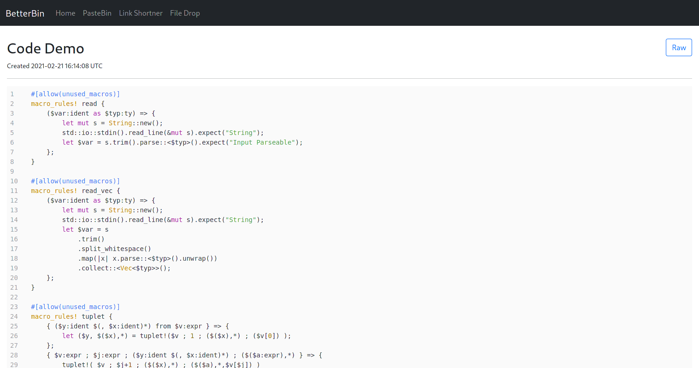

# BetterBin

 
Self-hosted pastebin, link shortner and file drop solution.

## Features
* API based, everything can be interacted with using CLI or code.
* Pastebin.
* Markdown or syntax highlighting typre preview for pastes.
* Add expiry to pastes or burn them after reading.
* Password protect pastes.
* Link Shortner.
* File Drop.
* Imgur like preview for image or video file drops.

## API Documentation

### Pastebin
TBA
### Link Shortner
TBA
### File Drop
TBA

## Deployment Instructions

### Manually
TBA
### Docker
TBA

## Contributing

* Database migrations are done using [goose](https://github.com/pressly/goose).
* Read the makefile.